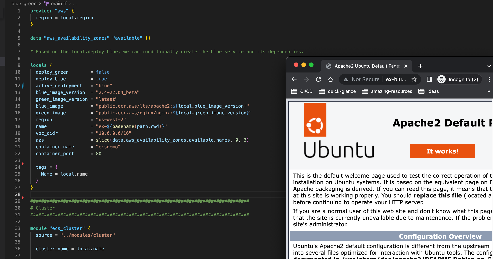
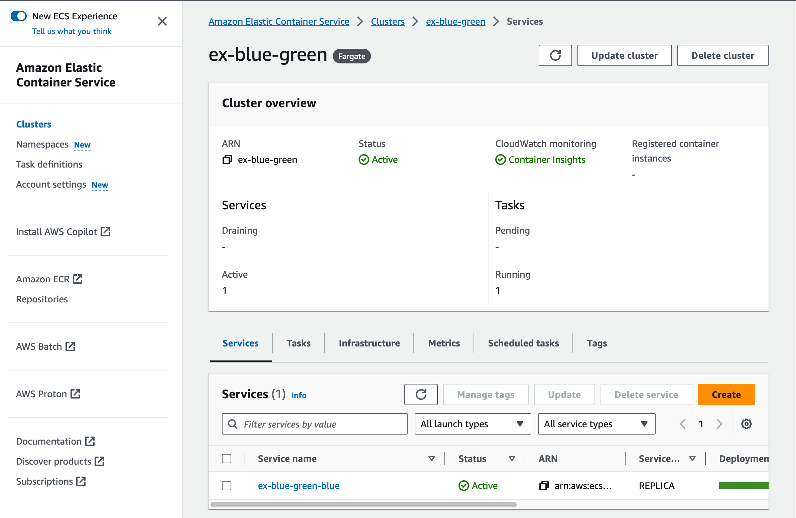
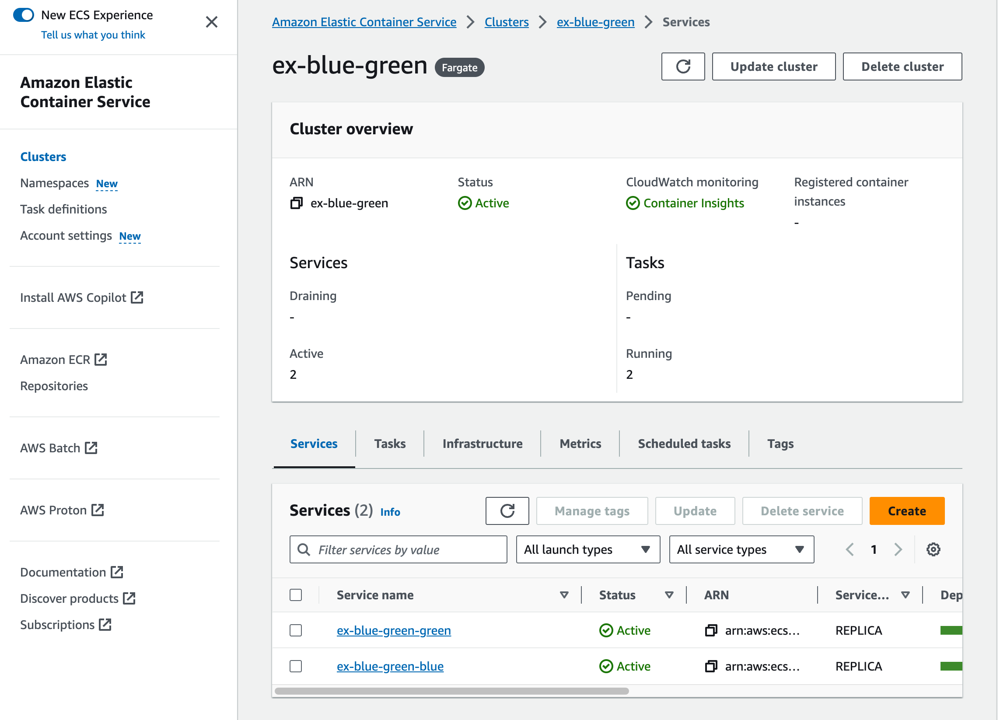
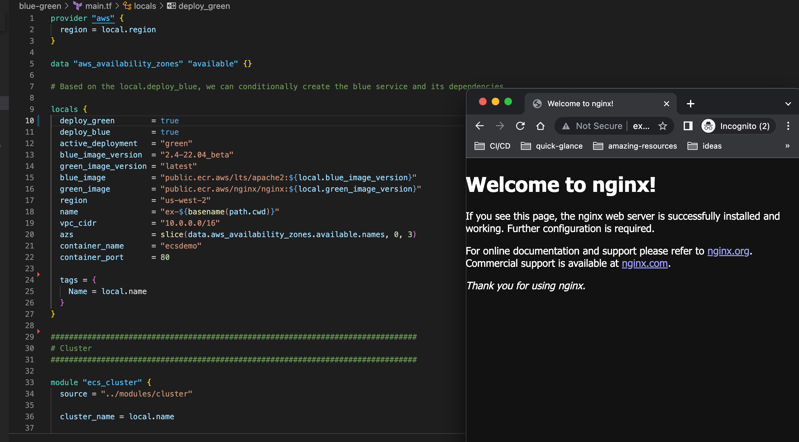
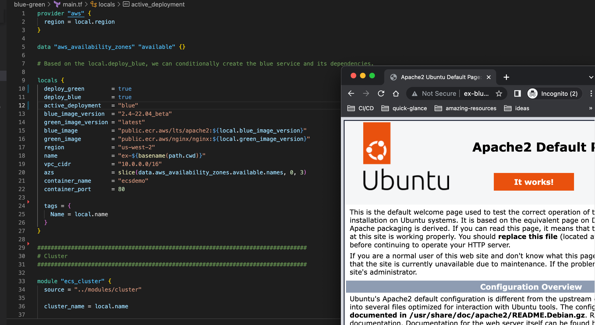
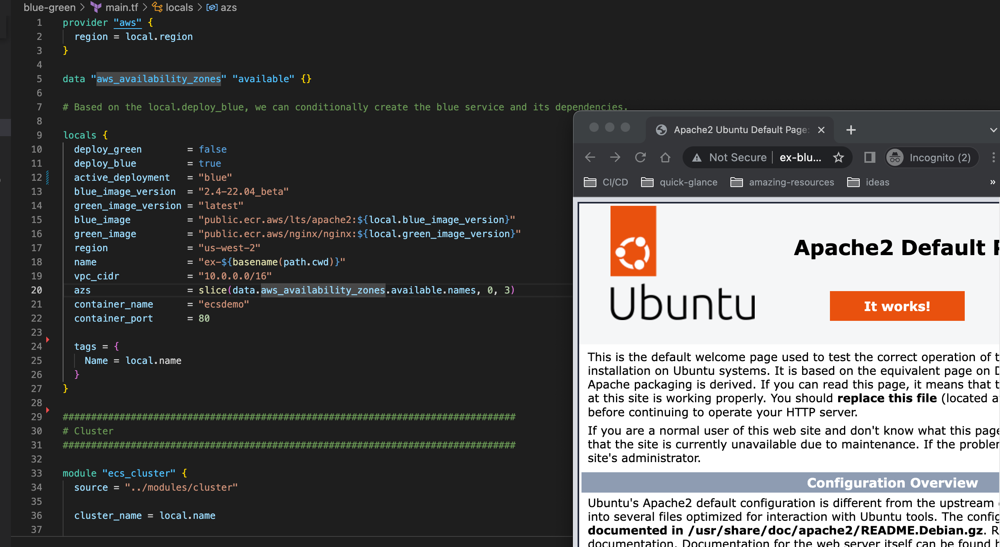

## Demo: Rollback with Blue-Green Deployment on ECS

In this demo, our apache container is actively running in Blue Service in ECS. Imagine this is our current prod deployment, and we want to push a new one.

We’ll control deployment and rollback via Terraform, using locals in main.tf

As seen above, there’s one active ex-blue-green-blue Service.

---

For creating a new Prod deployment, all we have to do is:

1. update green_image local in main.tf with our latest image
2. set deploy_green = true.
3. run terraform apply

This will create an ex-blue-green-green Service in the cluster.

Next, we need to forward traffic to our new deployment environment, to Green.

Again, we only need to update locals in main.tf:
1. set active_deployment = "green"
2. run terraform apply

New Green environment will be available.

--- 

If any problem isn’t monitored in the time slot defined according to your SLOs, “deploy_blue = false” can be set, and the old container service will be destroyed.

If rollback is needed, it can be done in seconds:
1. setting “active_deployment = blue“ 
2. terraform apply

And pre-deployment environment will be available again.

Then “deploy_green = false” can be set to remove the problematic deployment.

