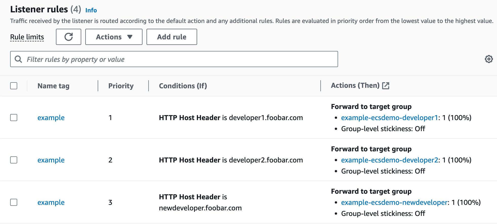

# Header-based Multi-Service deployment on ECS with Terraform

Deploy new container instances and automatically create subdomain routes for them on AWS ECS using Fargate. It enables developers to work on different instances of the application. 

Core components include: 
- Multiple container Services in ECS
- Dynamic Target Groups
- Application Load Balancer with Forward Blocks
- Head-based routing rules for Load Balancer Listener

## Overview:

**main.tf:**
- Sets global configurations, AWS region, and ECS cluster initialization.
- Holds the primary locals for defining developers and their specifics.
- Subdomains, and image tag control will be handled with local values here. 

**deployment.tf:**
- Details the ECS services corresponding to each developer.
- CloudMap namespace creation for service discovery.

**alb.tf:**
- Configuration of the VPC, subnets, security groups.
- Sets up the ALB and listener rules for subdomain traffic direction.
ased on weightings.

## Usage:

1. Deployment Control is done via locals in main.tf:
```bash
locals {
  region   = "us-west-2"
  name     = "example"
  domain   = "foobar.com"
  image    = "public.ecr.aws/lts/apache2"
  vpc_cidr = "10.0.0.0/16"
  ecs_services_map = {
    for key, service in local.ecs_services : key => {
      index   = index(keys(local.ecs_services), key),
      service = service
    }
  }
  azs = slice(data.aws_availability_zones.available.names, 0, 3)
  ecs_services = {
    developer1 = {
      container_name = "ecsdemo"
      container_port = 80
      image_tag      = "2.4-22.04_beta"
      domain         = "developer1.${local.domain}"
    },
    developer2 = {
      container_name = "ecsdemo"
      container_port = 80
      image_tag      = "latest"
      domain         = "developer2.${local.domain}"
    }
  }
```

2. **Add/Update Developer Environment**:

```bash   
    newdeveloper = {
      container_name = "ecsdemo"
      container_port = 80
      image_tag      = "latest"
      domain         = "newdeveloper.${local.domain}"
    }
```


3. On successful deployment, environments will be accessible via subdomains i.e. newdeveloper.foobar.com

---

## Under the Hood: 

Everytime a new environment is added/updated: 

1. ECS pulls the specified image, with the specified **image_tag**.
2. The newly deployed service get registered with AWS Service Discovery under CloudMap namespace.
3. New Target Group gets created. 
4. A new listener rule is added to ALB with the private IP of the new environment Target Group. 
5. ALB ensures _newdeveloper.foobar.com_ gets routed to the new environment.
6. newdeveloper.foobar.com becomes accessible.  


