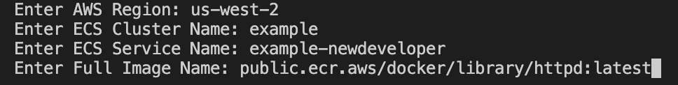
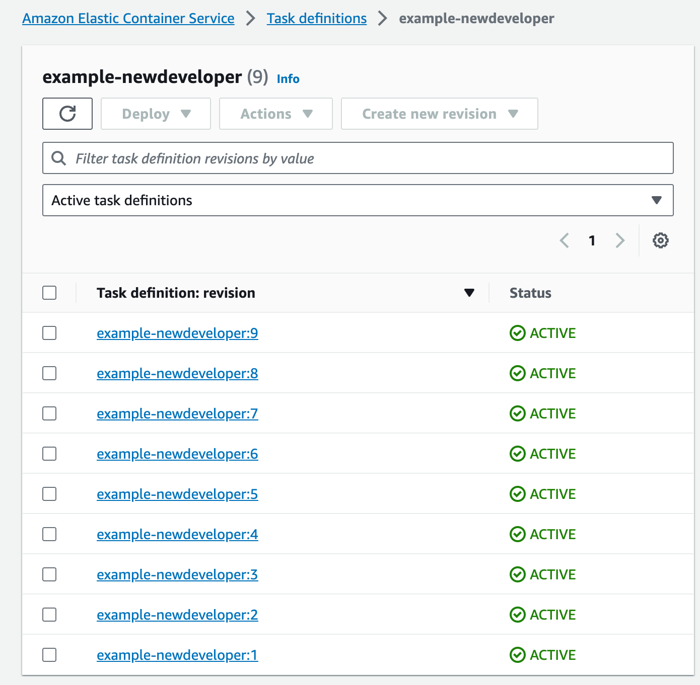
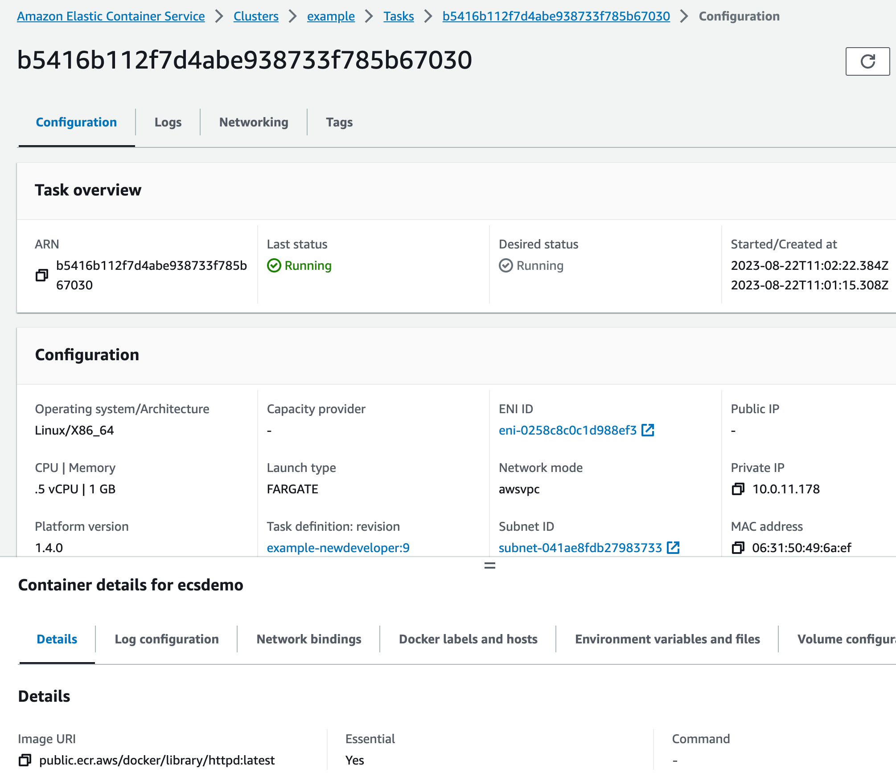

# ECS Image Updater Script: updateImage.sh

A Bash script to update the Docker image for an AWS ECS (Elastic Container Service) service in a specific cluster. This script helps streamline the process of switching to a new Docker image for your ECS service.

## Prerequisites

- [AWS CLI](https://aws.amazon.com/cli/) installed and configured with the necessary permissions.
- An AWS ECS cluster and service that you wish to update.
- A Docker image you want to switch to, hosted in a container registry.

## Usage

1. Provide the script with execute permissions: 
   ```bash
   chmod +x updateImage.sh
   ./updateImage.sh

2. Follow the on-screen prompts to provide:
   - AWS Region
   - ECS Cluster Name
   - ECS Service Name
   - Full Image Name (e.g., public.ecr.aws/docker/library/httpd:latest)

After the script runs, it will update the ECS service to use the provided Docker image.

## How it Works








--- 

# ECS Rollback to Revision: rollback.sh  

## Usage

1. Provide the script with execute permissions:

   ```bash
   chmod +x rollback.sh
   ```
3. Run the script with necessary arguments:

```bash
./script_name.sh <cluster-name> <service-name> <task-family>
```
Example:

```bash
./script_name.sh my-cluster my-service my-task-family
```

After the script execution, your ECS service will be rolled back to the previous task definition 
